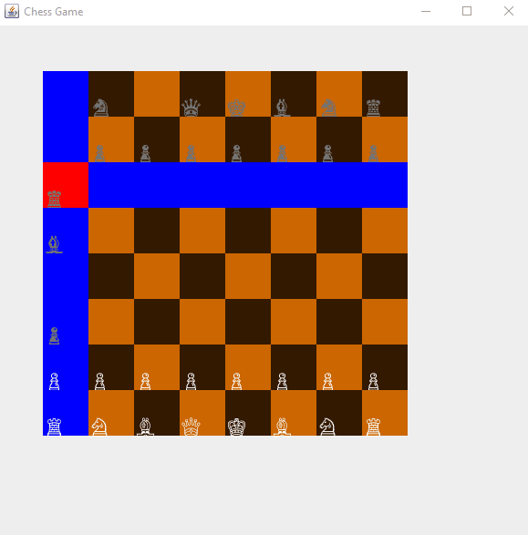

## Chess Checklist
- [ ] Base Chess Engine
    - [x] Create pieces with respective moves
        - [ ] Pieces
            - [x] Colors
            - [x] Moves
                - [x] Scaleable moves (i.e A knight that can move in constant Ls and can be blocked)
                - [x] Implementation of moves given characteristics
            - [ ] Pawn Moves
        - [x] Base chess Pieces (Knight, Rook, etc.)
    - [ ] GUI
        - [x] Chessboard tiles
        - [x] Chesspiece drawing (Just settled on drawing encodings)
            - [x] White
            - [x] Black
        - [ ] Piece moving (Click piece and click target tile)
            - [x] Initial piece selection
            - [x] Possible moves
        - [ ] Text
            - [ ] Tile names (A1, C5, etc.)
            - [ ] Previous moves
    - [ ] Rules module
        - [ ] Blocking
        - [ ] Check
        - [ ] Checkmate
    - [ ] 2 players
        - [ ] Turns

- [ ] Chess Engine Extras
    - [ ] Rules
        - [ ] Draw
        - [ ] En passant
        - [ ] Castling
    - [ ] State saving
        - [ ] Loadable chess board from text file
        - [ ] Save/load user state
    - [ ] Artificial Intelligence (AI)
        - [ ] Open source
            - [ ] One difficulty
            - [ ] Multiple difficulties
        - [ ] Custom script
    - [ ] Network
        - [ ] Play over local network
        - [ ] Play over TCP

### Description:
I make a scaleable chess engine such that it may be able to create awesome pieces with insane moves. First time making an actual graphical project from scratch. It is very satisfying thus far.  
The moves that the pieces aren't hardcoded! A pawn can be set to behave like a Queen (or any other piece) in no more than 5 lines of code!  
This project first started as an attempt of a custom scaleable impementation for Stanford's CS106A.  
To see the others click [here](https://github.com/yinghaoawang/DIY-CS106A.git)

### Understanding the code:
If one wants to dissect the code, here is a simple path one may take:
* Runner.java
    * chess/ChessApp.java
        * chess/Board.java
            * chess/piece/Piece.java
            * chess/move/Move.java

## Progress GIFs
### 3/14

### Things learned:
- Due to packaging, I now learn of the importance of class access. Especially package-private.
- Using a different Makefile given a package with subdirectories (i think that's what you call them, i.e chess/piece/\* etc)
- Further solidified the concept of mapping x to columns, and y to rows
- Slightly better understanding of the placement of try catch blocks and throwing error exceptions

