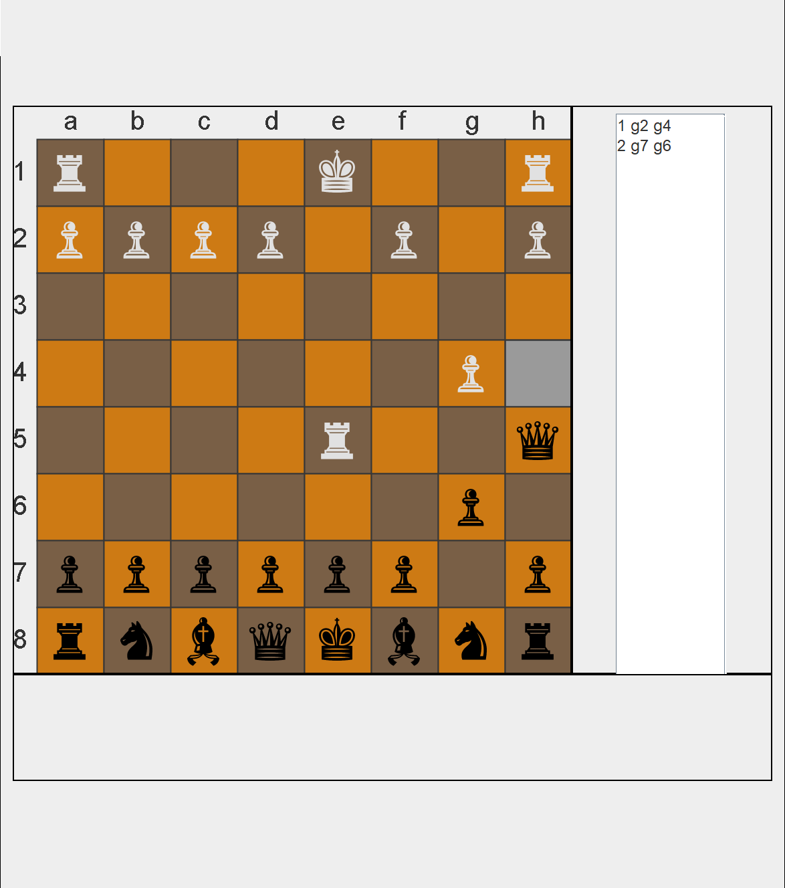

# Super Chess
## Description:
Super Chess is a chess engine that is able to create pieces with dynamic moves easily.
The base game is able to play Chess completely. All special moves like En Passant have been
implemented. 

## How to run
- Requires Java to be installed.
- Download/git clone the program
- On command line (Mac/Linux terminal):
    - Enter the directory containing the Makefile
    - Run the command "make"
    - Run the command "./run"
- On Intellij IDEA:
    - Open the project folder
    - Compile and run ChessGameRunner
- On Windows' Linux Subsystem
	- Install X server on Windows, I prefer Xming
	- In Linux Subsystem, run the line "export DISPLAY:= 0"
    - Run the command "make"
    - Run the command "./run"

## Built with
- Java AWT & Swing - GUI & other graphics
- IntelliJ IDEA - IDE

***

# Developer's self reflective progress reports
## Chess Checklist
- [x] Base Chess Engine
    - [x] Create pieces with respective moves
        - [x] Functional Pieces
            - [x] Colors
            - [x] Moves
                - [x] Scaleable moves (i.e A knight that can move in constant Ls and can be blocked)
                - [x] Implementation of moves given characteristics
            - [x] Pawn Moves (Double move, eating diagonally only)
            - [x] Special Moves
                - [x] Castling
                - [x] En Passant
        - [x] Base chess Pieces (Knight, Rook, etc.)
    - [x] GUI
        - [x] Chessboard tiles
        - [x] Chesspiece drawing (Just settled on drawing encodings)
            - [x] White
            - [x] Black
        - [x] Piece moving (Click piece and click target tile)
            - [x] Initial piece selection
            - [x] Possible moves
        - [x] Text
            - [x] Tile names (A1, C5, etc.)
            - [x] Previous moves
        - [x] Graves (eaten pieces)
    - [x] Rules
        - [x] Check
        - [x] Checkmate
        - [x] Blocking
        - [x] Game states
            - [x] White/Black Win
            - [x] Draw
    - [x] 2 players
        - [x] Turns
        - [x] Graves
    - [x] Modularize
        - Chess game
            - [x] Chess game
        - Displays
            - [x] Chess game frame
            - [x] Chess board panel
            - [x] Chess board move panel
            - [x] Chess grave panel
            - [x] Chess info panel
            - [x] Chess buttons panel
                - [x] New Game
                - [x] Undo

<!---
- [ ] Chess Engine Extras
    - [ ] State saving
        - [ ] Loadable chess board from text file
        - [ ] Save/load user state
    - [ ] Artificial Intelligence (AI)
        - [ ] Open source
            - [ ] One difficulty
            - [ ] Multiple difficulties
        - [ ] Custom script
    - [ ] Network
        - [ ] Play over local network
        - [ ] Play over TCP
-->

### Things learned:
- The importance of modularity and how it is able to make a large codebase readable
- Due to packaging, I now learn of the importance of class access. Especially package-private.
- Using a different Makefile given a package with subdirectories (i think that's what you call them, i.e chess/piece/\* etc)
- Slightly better understanding of the placement of try catch blocks and throwing error exceptions
- Basics of character encodings in java
- Exercised the practice of writing readable code (i.e the board move determination from 4-6 nested for loops to 2)
- The active practice of "high cohesion, loose coupling" (primarily when I split up the board and created logic and display modules)

## Progress Visuals
### 1/16/18

*Update: Almost completely finished besides with 3 draw cases*

### 1/7/18 night

*Update: Special moves: en passant*
### 1/7/18

*Update: Special moves: castling*
### 1/5/18

*Update: Check added and working. Works for moving king, blocking king, and eating threat*

### 1/2/18

*Update: Back to working on this project. Layout made modular and smooth, twitchy graveyard fix*

### 3/16/17 modularity [blueprint](https://raw.githubusercontent.com/yinghaoawang/Super-Chess/master/images/blueprint_3-16-17.png)

### 3/16/17

*Update: Graveyard and display added*

### 3/15/17

*Update: Moveable pieces and most piece move logic (blocking, extending of moves, etc.)  
List of board moves displayed in text area*

### 3/14/17

*Update: Visual GUI with mouse events, board movement determination, piece encoding display*

### 3/09/17

*Initial: Board, tile, selected tile, move, and piece base logic  
Graphics for chessboard tiles, and drawn symbols for pieces*
