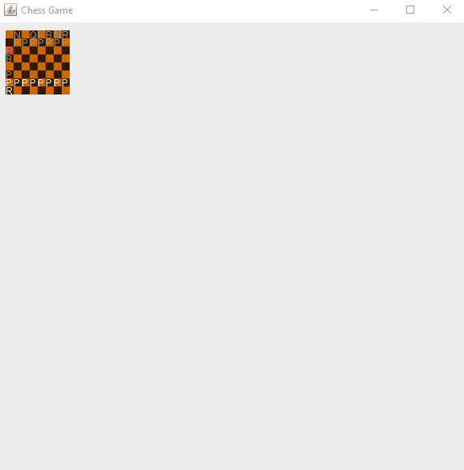

## Progress Visuals
### 1/16/18

*Update: Almost completely finished besides with 3 draw cases*

### 1/7/18 night

*Update: Special moves: en passant*
### 1/7/18

*Update: Special moves: castling*
### 1/5/18

*Update: Check added and working. Works for moving king, blocking king, and eating threat*

### 1/2/18

*Update: Back to working on this project. Layout made modular and smooth, twitchy graveyard fix*

### 3/16/17 modularity [blueprint](https://raw.githubusercontent.com/yinghaoawang/Super-Chess/master/images/blueprint_3-16-17.png)

### 3/16/17

*Update: Graveyard and display added*

### 3/15/17

*Update: Moveable pieces and most piece move logic (blocking, extending of moves, etc.)
List of board moves displayed in text area*

### 3/14/17

*Update: Visual GUI with mouse events, board movement determination, piece encoding display*

### 3/09/17

*Initial: Board, tile, selected tile, move, and piece base logic
Graphics for chessboard tiles, and drawn symbols for pieces*
